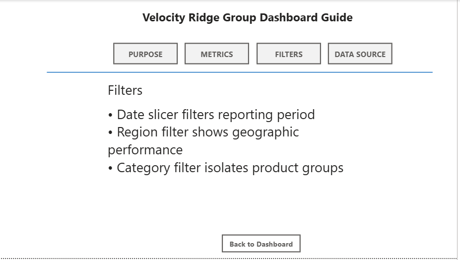

# Sales Performance Dashboard (Power BI)

## Overview
This project contains an interactive **Power BI dashboard** built using the **AdventureWorks** dataset to analyze sales performance, profitability, and product trends.

The dashboard provides an executive-level view of business performance through key performance indicators (KPIs), trend analysis, territory comparisons, and product category insights. Users can filter the dashboard by **year, territory, and product category**, allowing dynamic exploration of the data.

A drillthrough detail page enables deeper analysis of product category performance, showing revenue trends and subcategory-level profitability.

The report also includes an **interactive Dashboard Guide page** that explains how to use the dashboard and interpret the metrics.

---

## Dashboard Preview

### Main Dashboard

### Product Category Detail (Drillthrough Page)

### Product Performance Matrix

### Dashboard Guide / Info Page

The **Dashboard Guide** page provides an interactive explanation of the report using navigation buttons that allow users to switch between topics such as the dashboard purpose, metrics definitions, filter usage, and data source information.

---

## Key Features

- KPI cards for core business metrics:
  - Revenue
  - Gross Profit
  - Margin %
  - Orders
  - Units
  - Year-over-Year Revenue Growth
- Time-series analysis of revenue trends
- Territory-level revenue comparison
- Product category profitability analysis
- Conditional formatting to highlight profit margins
- Interactive slicers for year, territory, and product category
- Drillthrough page for detailed subcategory analysis
- Dynamic title based on selected product category
- Interactive **Dashboard Guide page** with navigation buttons and bookmarks

---

## Dashboard Guide (Info Page)

The report includes a dedicated **Dashboard Guide page** to help users understand how to interact with the dashboard.

This page contains navigation buttons that allow users to switch between explanations for:

- **Purpose** – Overview of what the dashboard analyzes
- **Metrics** – Definitions of key performance indicators
- **Filters** – Instructions for using slicers and filters
- **Data Source** – Information about the dataset used

Bookmarks and buttons are used to dynamically change the displayed content, creating an interactive help system directly within the report.

---

## Tools & Technologies

- **Power BI Desktop**
- **Microsoft SQL Server**
- **AdventureWorks Database**
- **DAX (Data Analysis Expressions)**

---

## Skills Demonstrated

- Data modeling and transformation
- DAX measure creation
- Interactive dashboard design
- Drillthrough navigation
- Conditional formatting for insights
- Bookmark navigation and interactive UI elements
- Business performance analysis

---

## Project Structure
